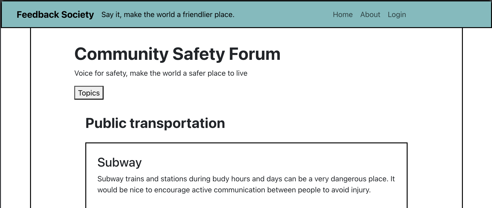
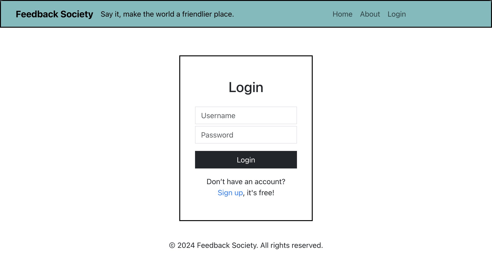
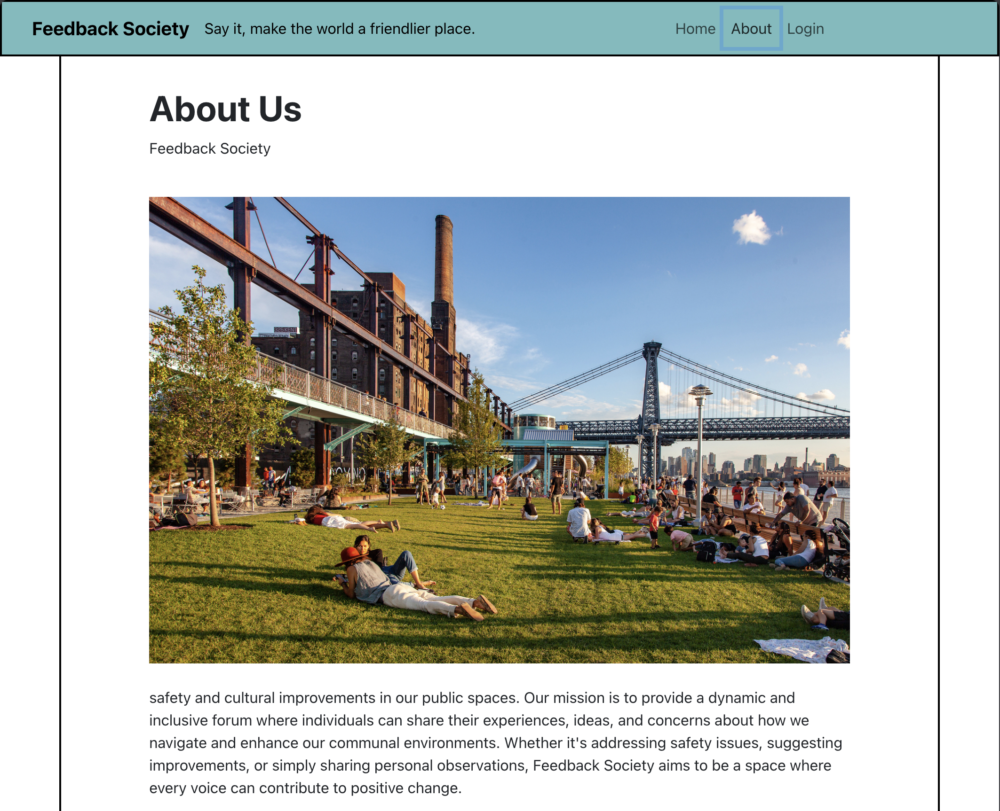
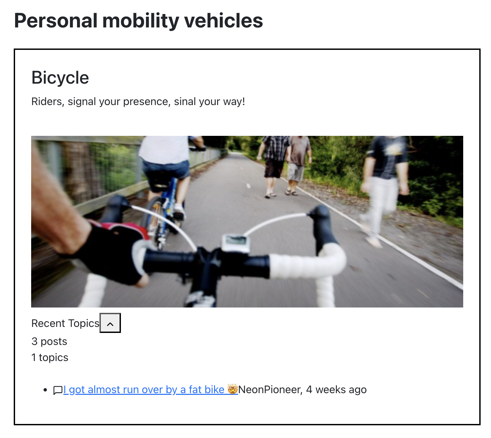
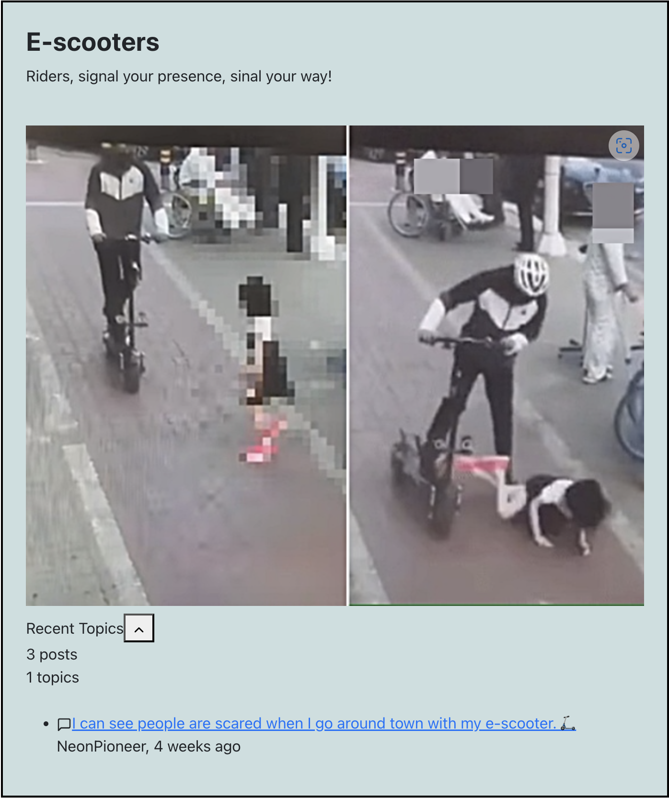

# Feedback Society 



Hi. This is a project repo which I developed as part of a hackerthon [Seoul Tech Impact 2024](https://www.seoultechimpact.com/). As a one-person team, I built a skeleton website in React to conceptualise the social cause I want to promote. It was a 24-hour thon so the code and the project structure is a bit messy, but it was a fun endeavour!

## Details

[Hackerthon]
- My submission on [Devpost](https://devpost.com/software/feedback-society?ref_content=user-portfolio&ref_feature=in_progress
)
- [Seoul Tech Impact 2024](https://www.seoultechimpact.com/)

[Project]
- Project App [Feedback Society](https://feedback-society.vercel.app/)
- 24-hour hackerthon 
- One-person team
- Skeleton website in React + Backend + Postgres RDS on AWS

## Problem Statement
 Strangers in public spaces rarely communicate in Korea. This can (and seems to often do) cause problems like physical harm (collision, injury) or add to mental harm (stress, anxiety, public phobia). Things don't have to do this way. We can improve our culture of interacting in public by changing our habits and mindset.

 My project is a simple prototype of this concept. It’s just a react skeleton, but Ideally, it should serve as a community forum like Reddit that provides safe space where people can freely talk. Freely talk, but specifically about how we can make  public spaces a safer place by communicating more clearly between strangers. And communication doesn’t have to be lengthy or complicated. It starts from simple “excuse me” or “pardon me” or “thank you”. Hopefully the visualisation of such conversations in this conceptual community forum encourages strangers in public spaces to communicate more clearly in reality.

 [Project Beneficiaries] 
 - General public
 - People interested in improving public safety in public spaces

## Solutions overview

   

This is a membership based community forum. Users can sign in or sign up.



Feedback Society is a not-for-profit organisation working to exert soft and positive influence over the general public to help shape more respectful, but direct and clear communicating culture to improve public safety. 

    

The forum offers various public safety categories. Users can freely create posts on each forum categoroy and exchange their ideas. 

[Inspirations]  
- Social cause - https://grieflifeline.org/
- App architecture - https://www.reddit.com/
- Frontend design - https://www.fullstackfoundations.com/

## (Personal) achievement
- I applied for Seoul Impact 2023 and I was there, but I withdrew because I thought I wasn't good enough to create and build anything. 
- This year in 2024, at least I built a skeleton and people can "see" my cause. I'm very proud of my personal progress.


## Troubleshooting notes

- set things up for database (psql)
    - `npm install express pg`
    - `npm install sequelize pg pg-hstore`
    - start backend server
        - `node src/index.js`
    - test API endpoint 
        - `http://localhost:5000/api/data`

- Set Up Concurrent Running for Frontend and Backend
    - at project root: `npm install concurrently --save-dev`

- Database troubleshooting
    - `ping your-db-instance-name.region.rds.amazonaws.com`
    - `psql -h your-db-instance-name.region.rds.amazonaws.com -U your-db-username -d your-database`
    - `nc -zv your-db-instance-name.region.rds.amazonaws.com -U your-db-username 5432`

- RDS while connection error: no pg_hba.conf entry for host https://stackoverflow.com/questions/76899023/rds-while-connection-error-no-pg-hba-conf-entry-for-host

- connect to the database within the RDS instance
    - `postgres=> \c feedback_society`
        ```
        feedback_society=> \dt
                    List of relations
        Schema |     Name      | Type  |  Owner   
        --------+---------------+-------+----------
        public | categories    | table | postgres
        public | forums        | table | postgres
        public | recent_topics | table | postgres
        ```